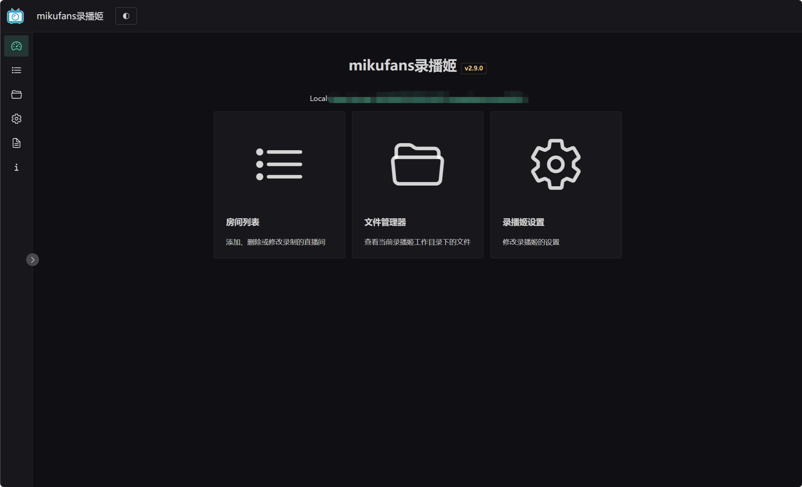

# B 站录播姬

源项目: <https://github.com/BililiveRecorder/BililiveRecorder>

一个方便好用免费开源的 mikufans 直播录制工具。

- 需要安装 `ffmpeg` 且加入系统环境变量。
- 理论上会自动新建工作目录，默认为共享文件夹 `Download` 下新建的 `BililiveRecorder` 文件夹。如果安装失败，请手动创建工作目录。
- 默认端口 `8923`，用户名 `qnap`，密码取 `$HOSTNAME` 的值，即控制台常规设置里的服务器名称，如果本机默认位置 `/etc/stunnel/` 存在证书，则以 `HTTPS` 运行，否则以 `HTTP` 运行。

[v2.13.0](https://github.com/Jay-Young/qpkg/releases/tag/v2.13.0_BililiveRecorder)

- MD5:
  - arm_64: e25339b4dfd2d8f94b7484fb417264e7
  - x86_64: 026fee76eca58ebb93d8f7a91abb1f58

[v2.11.1](https://github.com/Jay-Young/qpkg/releases/tag/v2.11.1_BililiveRecorder)

- MD5:
  - arm_64: 0315d3400372427333dc5eac97001da1
  - x86_64: 9e3a73b66d9e4a9369addd869a8f0492

[v2.11.0](https://github.com/Jay-Young/qpkg/releases/tag/v2.11.0_BililiveRecorder)

- MD5:
  - arm_64: 1b72b74b7b2b55eafb214cbed33f302f
  - x86_64: 4438082bb6119cff196c7f7ead00d585

[v2.10.1](https://github.com/Jay-Young/qpkg/releases/tag/v2.10.1_BililiveRecorder)

此前版本犯了个愚蠢的错误，创建下载目录和工作目录命令的条件判断有问题。

- MD5:
  - arm_64: cdc0014b5c7a4cfbbc08b54e46cea595
  - x86_64: d50b697f84ac05d50445cb0eaa4f4af7

[v2.10.0](https://github.com/Jay-Young/qpkg/releases/tag/v2.10.0_BililiveRecorder)

- MD5:
  - arm_64: c355baedd099b00a11814f02486d590d
  - x86_64: 4e87639ea8ebd326d55153e1ec1aeda4

[v2.9.1](https://github.com/Jay-Young/qpkg/releases/tag/v2.9.1_BililiveRecorder)

- MD5:
  - arm_64: e5f1e26e5d923c92ba4acd7057c93261
  - x86_64: fcc35689634c1ec64f4a56605b6b67ad

[v2.9.0](https://github.com/Jay-Young/qpkg/releases/tag/v2.9.0_BililiveRecorder)

- MD5:
  - arm_64: 05263281a0d55a258f378a2ef7eac496
  - x86_64: 36598c9c859df0cdbca56c7a28be8de1
