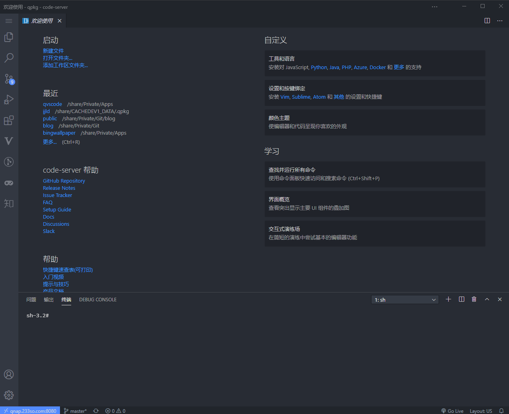
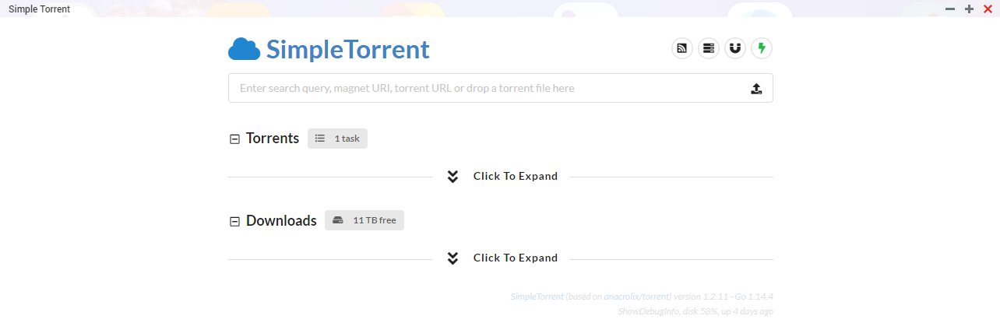
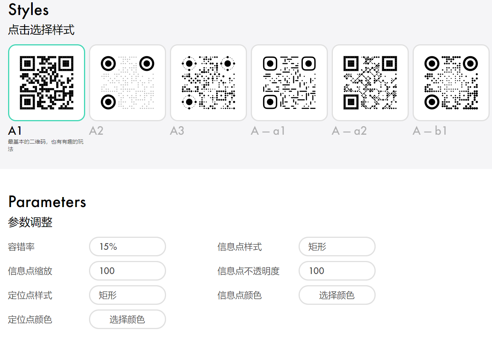
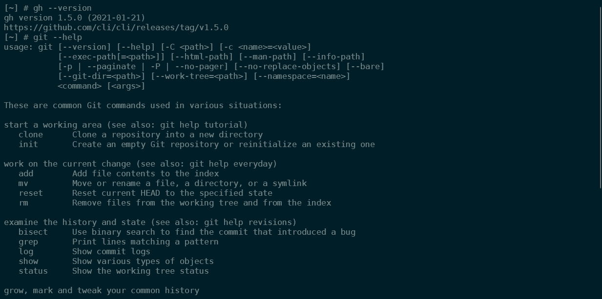
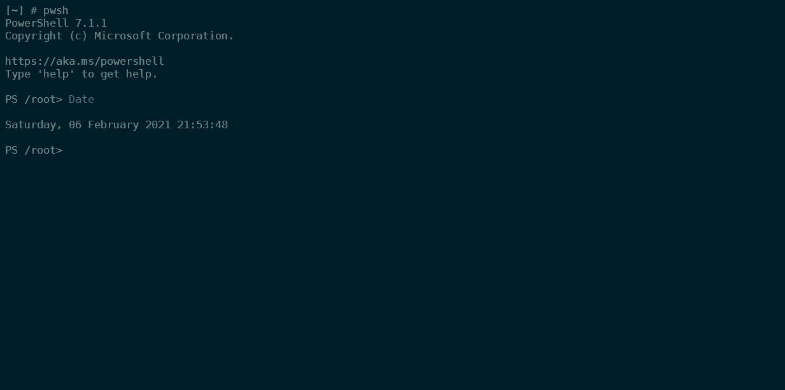
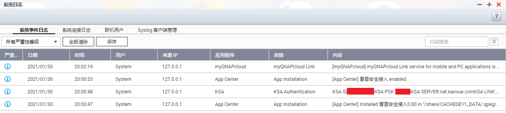

# QPKG list

> Note: test passed only with QNAP TS-453Bmini, x64 based, not for x86 or arm.

| App                                 |   Latest   |                                            Download                                            |                            Description                            |
| :---------------------------------- | :--------: | :--------------------------------------------------------------------------------------------: | :---------------------------------------------------------------: |
| [Code Server](#1-code-server)       |   3.8.1    |      [Click](https://github.com/Jay-Young/qpkg/raw/master/code-server/qvscode_3.8.1.qpkg)      |         Self-hosted third-party Visual Studio Codespaces          |
| [Simple Torrent](#2-simple-torrent) |   1.2.11   | [Click](https://github.com/Jay-Young/qpkg/raw/master/simple-torrent/simpletorrent_1.2.11.qpkg) | Self-hosted remote torrent client (rebranded from Cloud Torrent)  |
| [KMS](#3-kms)                       | 2020-03-28 |         [Click](https://github.com/Jay-Young/qpkg/raw/master/kms/kms_2020-03-28.qpkg)          |                           KMS Emulator                            |
| [Hugo](#4-hugo)                     |   0.70.0   |          [Click](https://github.com/Jay-Young/qpkg/raw/master/hugo/qhugo_0.70.0.qpkg)          |           Framework for building websites written in go           |
| [verysync](#5-verysync)             |   2.4.3    |       [Click](https://github.com/Jay-Young/qpkg/raw/master/verysync/verysync_2.4.3.qpkg)       |                     Sync client based on P2P                      |
| [Bing Wallpaper](#6-bing-wallpaper) |    1.1     |   [Click](https://github.com/Jay-Young/qpkg/raw/master/bingwallpaper/bingwallpaper_1.1.qpkg)   |  Automatically change QTS login screen background picture daily   |
| [QRBTF](#7-qrbtf)                   |    1.2     |           [Click](https://github.com/Jay-Young/qpkg/raw/master/qrbtf/qrbtf_1.2.qpkg)           |        QRBTF is a simple web app to beautify your QR code.        |
| [GitHub CLI](#8-github-cli)         |   1.5.0    |      [Click](https://github.com/Jay-Young/qpkg/raw/master/githubcli/githubcli_1.5.0.qpkg)      |                  Take GitHub to the command line                  |
| [PowerShell](#9-powershell)         |   7.1.2    |     [Click](https://github.com/Jay-Young/qpkg/raw/master/powershell/powershell_7.1.2.qpkg)     |    Cross-platform automation and configuration tool/framework     |
| [Surf Game](#10-surf-game)          |    1.0     |            [Click](https://github.com/Jay-Young/qpkg/raw/master/surf/surf_1.0.qpkg)            |                  Microsoft Edge Inside Game Surf                  |
| [KSA](#11-ksa)                      |    0.80    |            [Click](https://github.com/Jay-Young/qpkg/raw/master/ksa/KSA_0.80.qpkg)             | reverse proxy to expose a local server behind NAT to the Internet |
| [BestTrace](#12-besttrace)          |    1.2     |       [Click](https://github.com/Jay-Young/qpkg/raw/master/besttrace/besttrace_1.2.qpkg)       |  Launch a traceroute request from your Linux system environment   |

## 1. Code Server

Source: <https://github.com/cdr/code-server>

[Download Link](code-server/qvscode_3.8.1.qpkg)

MD5: d4cfae82da0f65530c0616114db9623a



---

**Features**

- Updated coder cloud agent.

**Bug Fixes**

- Fix initial connection failures (at least one form of them).
- Add more logging around connections to help us debug problems there.
- Fix potential 500 when loading VS Code in parallel.
- If the cloud agent fails to curl during an npm/yarn install it will no longer quit the install.

---

**QPKG Description**

- Default port: 8080, default password: codeserver, default user data directory: `/share/***_DATA/.code-server/`
- You can change the port and password in the config file(`/share/***_DATA/.qpkg/qvscode/config/config.yaml`), after that, just restart the app to apply the config.
- So far, you can not change the user data directory, because the `user-data-dir` option is still not working in the `config.yaml`.
- if `/etc/stunnel/stunnel.pem` exists, copy the file to QPKG cert directory and start with ssl secure. If `/etc/stunnel/stunnel.pem` renewed, restart the app to update the cert.

🔙[Back to Index](#qpkg-list)🔙

## 2. Simple Torrent

Source: <https://github.com/boypt/simple-torrent>

[Download Link](simple-torrent/simpletorrent_1.2.11.qpkg)

MD5: 2f2a37dd46fac7dd9b9b30eff82984bd



- Default folder: `/opt/downloads`, `/opt/torrents`. You can change in the WebUI settings after installed.
- Default user and password: user, ctorrent. Create env to change, AUTH=user:ctorrent
- if `/etc/stunnel/stunnel.pem` exists, copy the file to QPKG install root and start with ssl secure. If `/etc/stunnel/stunnel.pem` renewed, restart the app to update the cert.
- This version contains `386, amd64, armv5, armv6, armv7, arm64` all binaries, the install script will automatically check the machine architecture to choose the correct version.

🔙[Back to Index](#qpkg-list)🔙

## 3. KMS

[Download Link](kms/kms_2020-03-28.qpkg)

MD5: 8d40ac6cdf60331f89deb4e584c8d5d7

Source: <https://github.com/Wind4/vlmcsd>

🔙[Back to Index](#qpkg-list)🔙

## 4. Hugo

[Download Link](hugo/qhugo_0.70.0.qpkg)

MD5: f89d487a8417fccc95d360500bd674dd

Source: <https://github.com/gohugoio/hugo>

**Attension**: GLIBCXX_3.4.21 required, so it will automatically download and install CodexPack (CodexPack_4.7.0.2_x86_64_20191031.qpkg) if not installed. You can install the latest CodexPack manually by yourself.

🔙[Back to Index](#qpkg-list)🔙

## 5. verysync

Source: <http://releases.verysync.com/releases>

[Download Link](verysync/verysync_2.4.3.qpkg)

MD5: e533e452cffce22df7e19e9deda3e819

🔙[Back to Index](#qpkg-list)🔙

## 6. Bing Wallpaper

[Download Link](bingwallpaper/bingwallpaper_1.1.qpkg)

MD5: c6f128025eff8c60c8188221b7b5584c

Source: modified from <https://github.com/kkkgo/DSM_Login_BingWallpaper>

**Changelog:**

[1.1]

- Change to download UHD(3840×2160) resolution images.

**Usage:**

- First you must change the login screen setting to the first template (single picture not the photo wall) in `Control Panel - General Settings - Login Screen`
- Automatically download Bing wallpaper daily and set it as the QTS login screen background picture
- Automatically save the wallpapers in path `$Share_Folder_Path/Public/BingWallPapers`. `$Share_Folder_Path` is usually like `/share/***_DATA/`, it differs from one machine to another.

🔙[Back to Index](#qpkg-list)🔙

## 7. QRBTF

Source: <https://github.com/ciaochaos/qrbtf>

[Download Link](qrbtf/qrbtf_1.2.qpkg)

- Add a new style.
  SP — 3
- Add dark mode.



🔙[Back to Index](#qpkg-list)🔙

## 8. GitHub CLI

Source: <https://github.com/cli/cli>

[Download Link](githubcli/githubcli_1.5.0.qpkg)

MD5: a0c74dac9c4ede60340b5d75b4183c39

For detailed manual here: <https://cli.github.com/manual>



🔙[Back to Index](#qpkg-list)🔙

## 9. PowerShell

Source: <https://github.com/PowerShell/PowerShell>

[Download Link](powershell/powershell_7.1.2.qpkg)

MD5: 0a43634d14c327c1a90d6a194b34fa8a

type `pwsh` in shell to use powershell

If you are new to PowerShell and would like to learn more, we recommend reviewing the [getting started](https://github.com/PowerShell/PowerShell/tree/master/docs/learning-powershell) documentation.



🔙[Back to Index](#qpkg-list)🔙

## 10. Surf Game

Source: <edge://surf> (click in Microsoft Edge)

[Download Link](surf/surf_1.0.qpkg)

MD5: 04cbf9faa712b32ec88e643a49dc567d


🔙[Back to Index](#qpkg-list)🔙

## 11. KSA

Source: <https://ksa.kanxue.com/> (Chinese Website)

[Download Link](ksa/KSA_0.80.qpkg)

MD5: 44b6dfdb4dd5f6ca153ed6e4c2faa7ee

KSA Service is only available for Windows, Linux and Mac. Check the KSA_ID and KSA_PSK in the "System Logs" panel.



More usage here: [https://bbs.pediy.com/thread-252417.htm](https://bbs.pediy.com/thread-252417.htm) (Chinese Website)

🔙[Back to Index](#qpkg-list)🔙

## 12. BestTrace

Source: <https://www.ipip.net>

[Download Link](besttrace/besttrace_1.2.qpkg)

MD5: f5f87df667f55193dbc7fd47c8a1d0c7

Launch traceroute requests from your Linux (X86/ARM)/Mac/BSD system environment, with link visualization, better compatibility, and support for JSON output.

<details>
<summary>More usage</summary>

```markdown
Usage of besttrace host [ packetlen ]
-6, --ipv6
Use ipv6.
-J, --json
Print traceroute result with JSON format.
-g, --lang string
Language only supported cn and en now.
-m, --maxhop int
Specifies the maximum number of hops (max time-to-live value) traceroute will probe. The default is 30. (default 30)
-a, --noas
Do not try to map IP addresses to AS when displaying them.
-n, --nodomain
Do not try to map IP addresses to host names when displaying them.
-l, --nolocation
Do not try to map IP addresses to location when displaying them.
-q, --queries int
Sets the number of probe packets per hop. The default is 3. (default 3)
-z, --sendtime int
Minimal time interval between probes (default 0).
If the value is more than 10, then it specifies a number in milliseconds, else it is a number of seconds (float point values allowed too).
Useful when some routers use rate-limit for ICMP messages.
-f, --starthop int
Specifies with what TTL to start. Defaults to 1. (default 1)
--sync
Send icmp package by sync.
-T, --tcp
Use TCP SYN for probes.
-V, --version
Print the version and exit.
-w, --waittime int
Set the time (in seconds) to wait for a response to a probe. (default 3)
```

</details>

🔙[Back to Index](#qpkg-list)🔙
