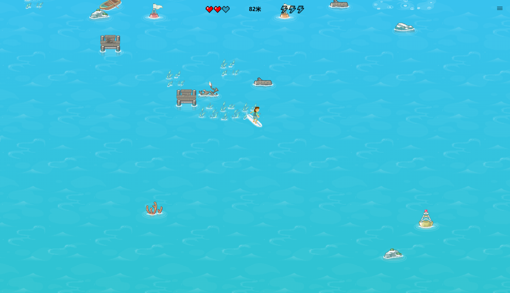

# QPKG list

> Note: test passed only with QNAP TS-453Bmini, x64 based.

| App            |   Latest   |                                            Download                                            |                           Description                            |
| :------------- | :--------: | :--------------------------------------------------------------------------------------------: | :--------------------------------------------------------------: |
| Code Server    |   3.6.1    |      [Click](https://github.com/Jay-Young/qpkg/raw/master/code-server/qvscode_3.6.1.qpkg)      |         Self-hosted third-party Visual Studio Codespaces         |
| Simple Torrent |   1.2.11   | [Click](https://github.com/Jay-Young/qpkg/raw/master/simple-torrent/simpletorrent_1.2.11.qpkg) | Self-hosted remote torrent client (rebranded from Cloud Torrent) |
| KMS            | 2020-03-28 |         [Click](https://github.com/Jay-Young/qpkg/raw/master/kms/kms_2020-03-28.qpkg)          |                           KMS Emulator                           |
| Hugo           |   0.70.0   |          [Click](https://github.com/Jay-Young/qpkg/raw/master/hugo/qhugo_0.70.0.qpkg)          |          Framework for building websites written in go           |
| verysync       |   1.5.5    |       [Click](https://github.com/Jay-Young/qpkg/raw/master/verysync/verysync_1.5.5.qpkg)       |                     Sync client based on P2P                     |
| Bing Wallpaper |    1.0     |   [Click](https://github.com/Jay-Young/qpkg/raw/master/bingwallpaper/bingwallpaper_1.0.qpkg)   |  Automatically change QTS login screen background picture daily  |
| QRBTF          |    1.2     |           [Click](https://github.com/Jay-Young/qpkg/raw/master/qrbtf/qrbtf_1.2.qpkg)           |       QRBTF is a simple web app to beautify your QR code.        |
| GitHub CLI     |   1.0.0    |      [Click](https://github.com/Jay-Young/qpkg/raw/master/githubcli/githubcli_1.0.0.qpkg)      |                 Take GitHub to the command line                  |
| PowerShell     |   7.0.3    |     [Click](https://github.com/Jay-Young/qpkg/raw/master/powershell/powershell_7.0.3.qpkg)     |    Cross-platform automation and configuration tool/framework    |
| Surf Game      |    1.0     |            [Click](https://github.com/Jay-Young/qpkg/raw/master/surf/surf_1.0.qpkg)            |                 Microsoft Edge Inside Game Surf                  |

<!-- TOC -->

- [QPKG list](#qpkg-list)
  - [1. Code Server](#1-code-server)
  - [2. Simple Torrent](#2-simple-torrent)
  - [3. KMS](#3-kms)
  - [4. Hugo](#4-hugo)
  - [5. verysync](#5-verysync)
  - [6. Bing Wallpaper](#6-bing-wallpaper)
  - [7. QRBTF](#7-qrbtf)
  - [8. GitHub CLI](#8-github-cli)
  - [9. PowerShell](#9-powershell)
  - [10. Surf Game](#10-surf-game)

## 1. Code Server

Source: <https://github.com/cdr/code-server>

[Download Link](code-server/qvscode_3.6.1.qpkg)

MD5: d5dd08ba1d522b97a19cfc770c94aaae

---

**Features**

- ⭐ We've updated from VS Code v1.49.3 to v1.50.0.
- Allow remote shells other than ssh when using the install script #2220

**Bug Fixes**

- Fix Docker image when using a custom UID #2223

---

**QPKG Description**

- Default port: 8080, default password: codeserver, default user data directory: `/share/***_DATA/.code-server/`
- You can change the port and password in the config file(`/share/***_DATA/.qpkg/qvscode/config/config.yaml`), after that, just restart the app to apply the config.
- So far, you can not change the user data directory, because the `user-data-dir` option is still not working in the `config.yaml`.
- if `/etc/stunnel/stunnel.pem` exists, copy the file to QPKG cert directory and start with ssl secure. If `/etc/stunnel/stunnel.pem` renewed, restart the app to update the cert.

## 2. Simple Torrent

Source: <https://github.com/boypt/simple-torrent>

[Download Link](simple-torrent/simpletorrent_1.2.11.qpkg)

MD5: 2f2a37dd46fac7dd9b9b30eff82984bd

- Default folder: `/opt/downloads`, `/opt/torrents`. You can change in the WebUI settings after installed.
- Default user and password: user, ctorrent. Create env to change, AUTH=user:ctorrent
- if `/etc/stunnel/stunnel.pem` exists, copy the file to QPKG install root and start with ssl secure. If `/etc/stunnel/stunnel.pem` renewed, restart the app to update the cert.
- This version contains `386, amd64, armv5, armv6, armv7, arm64` all binaries, the install script will automatically check the machine architecture to choose the correct version.

## 3. KMS

[Download Link](kms/kms_2020-03-28.qpkg)

MD5: 8d40ac6cdf60331f89deb4e584c8d5d7

Source: <https://github.com/Wind4/vlmcsd>

## 4. Hugo

[Download Link](hugo/qhugo_0.70.0.qpkg)

MD5: f89d487a8417fccc95d360500bd674dd

Source: <https://github.com/gohugoio/hugo>

**Attension**: GLIBCXX_3.4.21 required, so it will automatically download and install CodexPack (CodexPack_4.7.0.2_x86_64_20191031.qpkg) if not installed. You can install the latest CodexPack manually by yourself.

## 5. verysync

Source: <http://releases.verysync.com/releases>

[Download Link](verysync/verysync_1.5.5.qpkg)

MD5: 6f57d51f3bad7a9ab5f0f560fa48bc99

## 6. Bing Wallpaper

[Download Link](bingwallpaper/bingwallpaper_1.0.qpkg)

MD5: a02c10fdedbaeac6a5b9fbe616fcfcf6

Source: modified from <https://github.com/kkkgo/DSM_Login_BingWallpaper>

- First you must change the login screen setting to the first template (single picture not the photo wall) in `Control Panel - General Settings - Login Screen`
- Automatically download Bing wallpaper daily and set it as the QTS login screen background picture
- Automatically save the wallpapers in path `$Share_Folder_Path/Public/BingWallPapers`. `$Share_Folder_Path` is usually like `/share/***_DATA/`, it differs from one machine to another.

## 7. QRBTF

Source: <https://github.com/ciaochaos/qrbtf>

[Download Link](qrbtf/qrbtf_1.2.qpkg)

- Add a new style.
  SP — 3
- Add dark mode.

## 8. GitHub CLI

Source: <https://github.com/cli/cli>

[Download Link](githubcli/githubcli_1.0.0.qpkg)

MD5: 2fda03f70f4bfe0eb4a2af44444129cf

For detailed manual here: <https://cli.github.com/manual>

## 9. PowerShell

Source: <https://github.com/PowerShell/PowerShell>

[Download Link](powershell/powershell_7.0.3.qpkg)

MD5: ad9779a338400a016f910b8a3480cfe7

type `pwsh` in shell to use powershell

If you are new to PowerShell and would like to learn more, we recommend reviewing the [getting started](https://github.com/PowerShell/PowerShell/tree/master/docs/learning-powershell) documentation.

## 10. Surf Game

Source: <edge://surf> (click in Microsoft Edge)

[Download Link](surf/surf_1.0.qpkg)

MD5: 04cbf9faa712b32ec88e643a49dc567d

