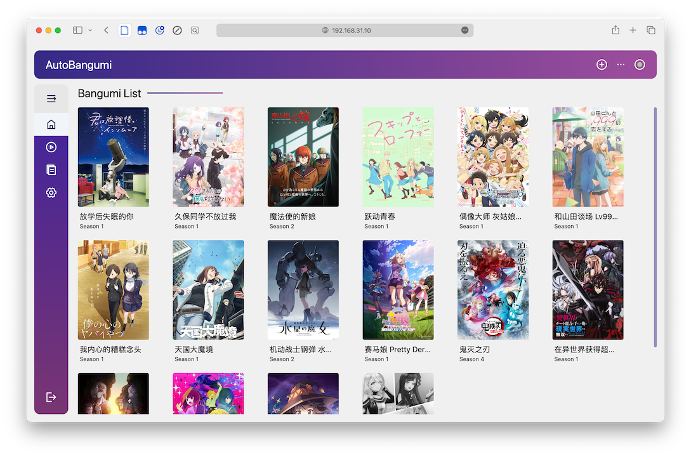

# AutoBangumi

源项目: <https://github.com/EstrellaXD/Auto_Bangumi>

AutoBangumi 是基于 Mikan Project、qBittorrent 的全自动追番整理下载工具。只需要在 Mikan Project 上订阅番剧，就可以全自动追番。并且整理完成的名称和目录可以直接被 Plex、Jellyfin 等媒体库软件识别，无需二次刮削。

安装依赖：

- container-station >= 2.0

[v3.1.1](https://github.com/Jay-Young/qpkg/releases/tag/v3.1.1_autobangumi)

- MD5: a75ac69daf0e8904bff02dcefb0fce03
- container-station 从 3.0 开始不再支持 `docker-compose` 命令，用 `docker compose` 代替，修复找不到命令的问题。
- 替换 `system-docker` 为 `docker` 命令，修复安装时会停止已经安装的 docker 应用容器问题。

[v3.0.12](https://github.com/Jay-Young/qpkg/releases/tag/v_autobangumi_3.0.12)

- MD5: 8f8b29e8a4e89eac74bb335afddfda45
