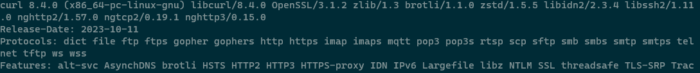

# cURL

源项目: <https://github.com/curl/curl>
可执行文件来源: <https://github.com/moparisthebest/static-curl>

- 替换系统自带的低版本 curl 工具，8.4.0 官方修复了 CVE-2023-38545 在内的安全漏洞，详见 <https://curl.se/docs/security.html>
- 启用则替换为 8.4.0 版本，停用则恢复系统默认版本

[v8.4.0](https://github.com/Jay-Young/qpkg/releases/tag/v8.4.0_cURL)

- MD5:
  - arm_64: 1878bba2001c130b308b2a4679a7cf6b
  - x86_64: a790ff5cc779b22d7edb748aeadf6b42
