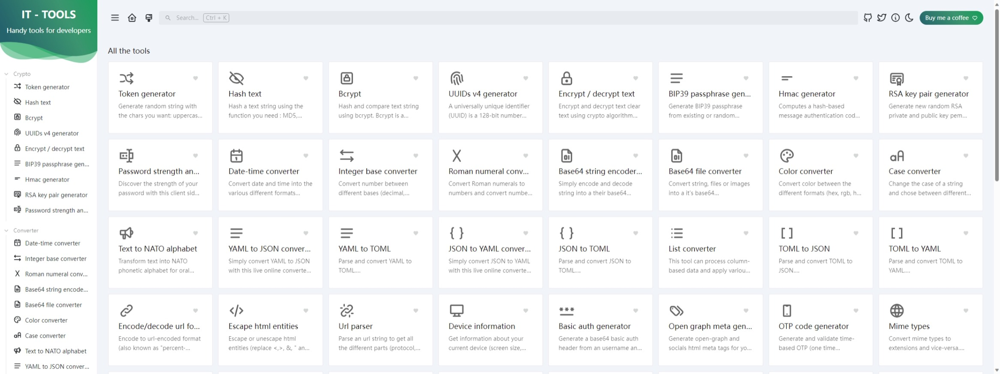

# IT Tools

源项目: <https://github.com/CorentinTh/it-tools>

IT Tools 为 IT 开发人员提供各种实用的在线工具。

[v2023.11.1](https://github.com/Jay-Young/qpkg/releases/tag/v2023.11.1_it-tools)

- MD5: e61e5a1f6fa16e53672e4c9f1d4ced32

[v2023.8.21](https://github.com/Jay-Young/qpkg/releases/tag/v2023.8.21_it-tools)

- MD5: 05263281a0d55a258f378a2ef7eac496
