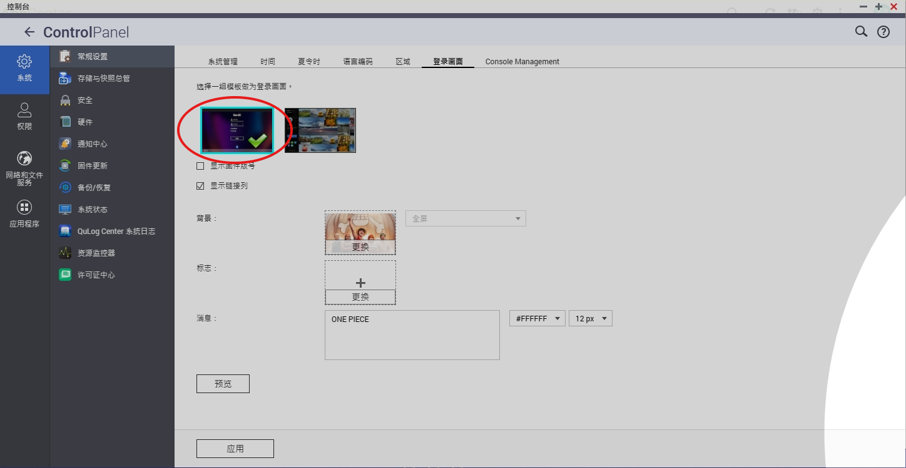

# TMDB Wallpaper

- 安装前，确认系统控制台-常规设置-登录画面选择的是单张图片，而不是照片墙。

- 不使用三方组件，全部使用 busybox 内置 shell 命令。
- 因为通过解析 HTML 页面，而不是使用 API，所以后续 TMDB 更改页面结构的话就会失效。
- 会自动备份 QTS 原始壁纸，停止或卸载应用会自动恢复原始壁纸。
- 壁纸默认保存在共享目录 Public 的 TMDB 目录下，以影片的标题命名。

[v1.0](https://github.com/Jay-Young/qpkg/releases/tag/v_tmdb_1.0)

- MD5: e7ed5d521abc6f174c47cce728a2f4cb
